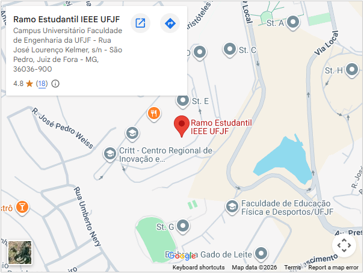

# Hi! I'm Rafael!

## About me

* I'm currently a infrastructure intern, IEEE Computer Society Student Branch chapter chair and volunteer at the education-oriented PART(Robotics and Technology Applications Project) in LiFA(Applied Physics Laboratory) of the Federal University of Juiz de Fora.
* I'm a Pernambuco native who moved to Belo Horizonte at a young age. 
* I am a Clube Atlético Mineiro fan!    
* Atualmente sou estagiário de infraestrutura, presidente do capítulo estudantil da IEEE Computer Society na Universidade Federal de Juiz de Fora, e voluntário no PART(Projeto de Aplicação em Robótica e Tecnologia), um projeto orientado à educação no LiFA(Laboratório de Física Aplicada) da Universidade Federal de Juiz de Fora.
* Sou nascido em Pernambuco, mas me mudei para Belo Horizonte ainda quando criança.
* Sou torcedor do Clube Atlético Mineiro!

## My current projects

* [IoT system for the IEEE Student Branch based on the Renesas Synergy S7G2 MCU](https://github.com/CSIEEEUFJF/IoT_Ramo_Renesas)
* [Doom proof of concept port for the Renesas Synergy S7G2 MCU](https://github.com/CSIEEEUFJF/DoomRenesas)
* [TwitterAPI.io twitter search scraping bot](https://github.com/rafaellnick/TwitterBasicScraping)

## Links

* [Universidade Federal de Juiz de Fora IEEE Student Branch](https://instagram.com/ieeeufjf)  
* [PART - Projeto de Aplicação em Robótica e Tecnologia](https://instagram.com/projeto_part)  
* [LinkedIn](https://linkedin.com/in/rafaellnick)

## Contact information

* [Email](mailto:rafael.nick@estudante.ufjf.br)

## Location:

* I'm mostly located at the [Universidade Federal de Juiz de Fora IEEE Student Branch](https://maps.app.goo.gl/7xG9RT2LoKHwGLq77) during my free time.
* Please try to contact me to schedule a online or in-person meeting.

##

 
